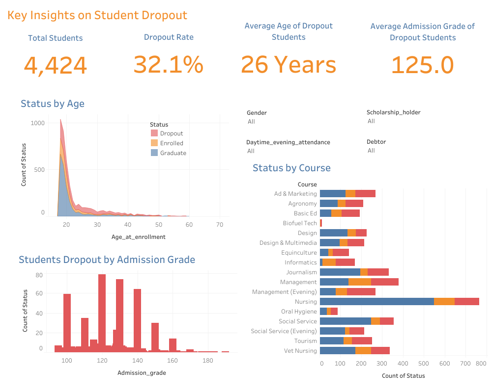

# Menyelesaikan Permasalahan Institusi Pendidikan

## Business Understanding

Sebuah institusi pendidikan tinggi yang telah berdiri sejak tahun 2000 memiliki reputasi baik dalam mencetak lulusan berkualitas. Namun demikian, mereka menghadapi tantangan serius berupa tingginya angka siswa yang tidak menyelesaikan pendidikan alias *dropout*. Kondisi ini tidak hanya berdampak pada reputasi institusi, tetapi juga pada efektivitas program pembelajaran dan keberhasilan akademik secara keseluruhan.

Untuk mengatasi permasalahan tersebut, pihak institusi ingin menerapkan pendekatan berbasis data yang mampu mendeteksi secara dini siswa-siswa yang berpotensi mengalami *dropout*. Dengan demikian, langkah-langkah intervensi yang tepat dapat segera diberikan agar siswa tetap dapat melanjutkan dan menyelesaikan pendidikannya.

### Business Problem

- Tidak adanya sistem yang mampu memantau dan memprediksi risiko *dropout* secara otomatis.
- Sulitnya mengidentifikasi siswa dengan performa rendah secara cepat dan menyeluruh.
- Keterbatasan akses terhadap insight data siswa untuk mendukung pengambilan keputusan strategis oleh pihak manajemen atau pendidik.
- Perlunya visualisasi data yang efektif agar pemantauan performa siswa dapat dilakukan secara lebih mudah dan efisien.

### Project Scope

- Melakukan eksplorasi data untuk memahami karakteristik siswa dan faktor-faktor yang mempengaruhi risiko *dropout*.
- Mengembangkan model machine learning untuk memprediksi kemungkinan siswa akan *dropout*.
- Membangun sebuah dashboard interaktif sebagai alat bantu pemantauan performa siswa dan visualisasi risiko *dropout*.
- Menyediakan prototype sistem prediksi berbasis web menggunakan Streamlit yang dapat digunakan oleh pihak institusi secara mudah.
- Memberikan rekomendasi berbasis data untuk mendukung kebijakan akademik dan strategi intervensi dini terhadap siswa berisiko tinggi.

  
### Preparation

**Data source:** [Students Performance data](https://github.com/dicodingacademy/dicoding_dataset/tree/main/students_performance)

**Setup environment:**

1. Clone this Repository
   ```bash
   git clone https://github.com/sitirobiiatul/Student-Dropout-Prediction.git
   ```

2. Create Python Virtual Environment
   ```bash
   virtualenv venv
   ```

2. Activate the Environment
   ```bash
   venv\Scripts\activate
   ```

4. Install All the Requirements Inside "requirements.txt"
   ```bash
   pip install -r requirements.txt
   ```

**To run the Streamlit prediction:**
```bash
streamlit run streamlit_app.py
```

**Streamlit Link**

Link cloud streamlit dapat diaksaes melalui: https://student-dropout-prediction-sitirobiiatul.streamlit.app/

## Business Dashboard

Dashboard interaktif ini dibuat menggunakan **Tableau** untuk membantu institusi pendidikan memahami pola dan faktor-faktor utama yang menyebabkan *student dropout* (putus studi). Visualisasi ini memberikan insight penting yang dapat digunakan untuk meningkatkan tingkat kelulusan mahasiswa.



Dashboard ini memberikan gambaran menyeluruh atas data mahasiswa, mencakup:

- Total mahasiswa dan dropout rate secara keseluruhan.

- Rata-rata usia mahasiswa yang dropout dan rata-rata admission grade mahasiswa yang dropout

- Distribusi status mahasiswa berdasarkan usia, Course dan distribusi mahasiswa dengan status dropout berdasarkan admission grade

Gunakan filter interaktif di sisi kanan dashboard yang terdiri dari **Gender**, **Daytime Evening Attendance**, **Scholarship Holder**, **Debtor** untuk mengeksplorasi pola attrition lebih dalam.

🔗 Akses Dashboard:
👉  [Klik di sini untuk melihat dashboard di Tableau Public](https://public.tableau.com/views/StudentDropoutDashboard_17475475051950/Dashboard1?:language=en-US&:sid=&:redirect=auth&:display_count=n&:origin=viz_share_link 'Tableau Public- Student Dropout Dashboard')

## Conclusion
Berdasarkan visualisasi data pada dashboard, berikut beberapa temuan penting terkait fenomena dropout mahasiswa:

- **Tingkat Dropout yang Signifikan**

Dari total 4.424 mahasiswa, 32.1% di antaranya teridentifikasi dropout, menunjukkan tingkat keberlanjutan studi yang cukup mengkhawatirkan dan perlu perhatian khusus dari institusi pendidikan.

- **Profil Mahasiswa Dropout**

Rata-rata usia mahasiswa yang dropout adalah 26 tahun, sedangkan rata-rata nilai penerimaan mereka adalah 125.0. Ini menunjukkan bahwa mahasiswa yang dropout cenderung lebih tua dan memiliki nilai akademik awal yang lebih rendah dibandingkan mahasiswa yang lulus.

- **Distribusi Dropout Berdasarkan Usia**

Sebagian besar dropout terjadi pada mahasiswa yang masuk di usia antara 18 hingga 30 tahun dengan jumlah tertinggi pada usia 18–22 tahun. Namun demikian, mahasiswa yang mendaftar pada usia lebih tua tetap menunjukkan tren dropout yang konsisten, meskipun jumlahnya lebih sedikit.

- **Hubungan Antara Nilai Masuk dan Dropout**

Mahasiswa dengan nilai penerimaan antara 110–140 menunjukkan tingkat dropout yang paling tinggi. Nilai penerimaan tampaknya berperan sebagai prediktor risiko dropout: semakin rendah nilai, semakin tinggi risikonya.

- **Dropout Berdasarkan Program Studi**

Program studi Nursing (Keperawatan) memiliki jumlah mahasiswa tertinggi, tetapi juga menyumbang jumlah dropout terbesar. Program Management (Evening) dan Informatics juga mencatat dropout yang tinggi. Sementara program seperti Biofuel Tech dan Oral Hygiene memiliki jumlah mahasiswa yang rendah, namun dropout tetap terjadi.

### Recommended Action Items

Berikut adalah rekomendasi kebijakan strategis yang dapat diambil berdasarkan temuan pada analisis data student performance:

- **Identifikasi Dini & Intervensi Personal untuk Mahasiswa Berisiko Tinggi**

Mahasiswa yang diprediksi memiliki risiko tinggi dropout dapat diberikan perhatian khusus, seperti konseling rutin, mentoring akademik, dan pendampingan oleh dosen pembimbing.

- **Program Bimbingan Akademik Berdasarkan Nilai & Jurusan**

Mahasiswa dengan nilai masuk rendah atau berasal dari jurusan dengan tingkat dropout tinggi (seperti Management atau Evening Programs) perlu diberikan akses ke kelas remedial, tutor khusus, atau sesi tambahan di luar jam kuliah.

- **Dukungan Finansial Bertarget**

Jika prediksi menunjukkan bahwa status debitur atau tidak menerima beasiswa merupakan faktor risiko utama, institusi dapat mempertimbangkan penyaluran bantuan dana pendidikan, program cicilan, atau relaksasi pembayaran bagi mahasiswa yang membutuhkan.

- **Optimalisasi Program Beasiswa**

Tingkat kelulusan yang lebih tinggi pada penerima beasiswa menunjukkan perlunya ekspansi skema beasiswa, terutama bagi mahasiswa dari latar belakang ekonomi lemah namun memiliki potensi akademik.

- **Penyesuaian Strategi Pembelajaran untuk Mahasiswa Lebih Tua**

Mahasiswa yang mendaftar di usia lebih tua (di atas 25 tahun) dapat diberikan opsi pembelajaran yang lebih fleksibel, seperti blended learning, kuliah daring, atau pendekatan berbasis proyek yang lebih relevan dengan pengalaman mereka.

- **Konseling Psikososial & Dukungan Non-Akademik**

Mahasiswa yang menghadapi tekanan non-akademik (usia lebih tua, sudah menikah, atau punya beban kerja luar kampus) dapat dibantu melalui layanan konseling psikologis, workshop manajemen waktu, dan komunitas dukungan sebaya (peer support).

- **Prediksi kemungkinan mahasiswa dropout**

Prediksi tingkat kemungkinan mahasiswa mengalami dropout dapat dilakukan melalui dashboard interaktif berbasis Streamlit. Pengguna cukup memasukkan karakteristik seorang mahasiswa (seperti usia pendaftaran, jenis kelamin, jurusan, nilai masuk, status keuangan, beasiswa, dan waktu perkuliahan), dan sistem akan memberikan estimasi apakah mahasiswa tersebut berisiko tinggi untuk dropout atau tidak.
